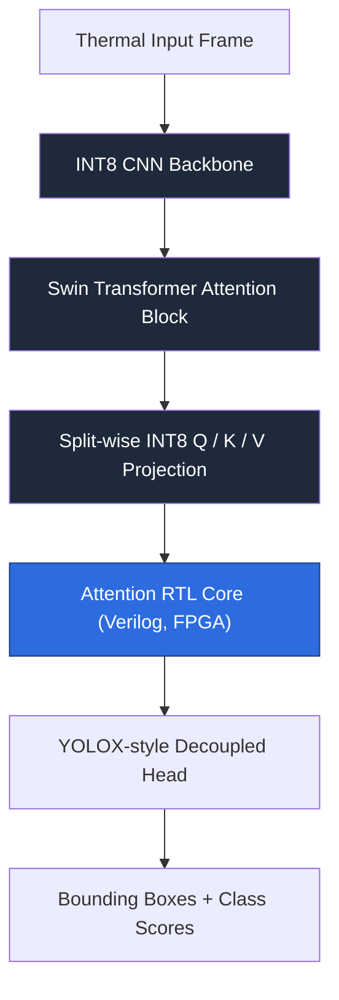
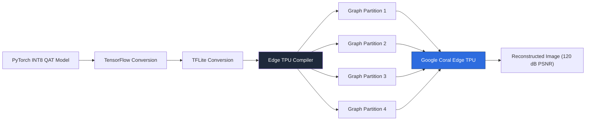
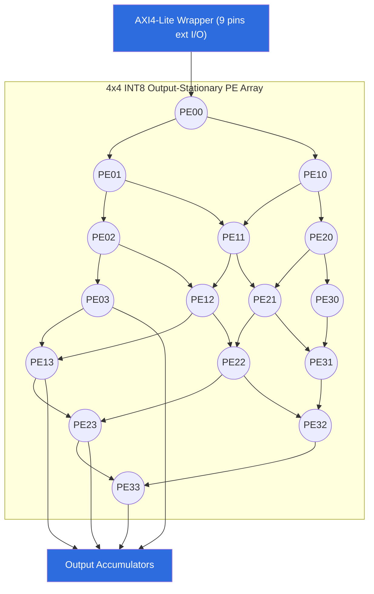

# Digital Design & Edge AI Hardware Projects

A collection of RTL and machine-learning projects — from foundational digital-logic building blocks to full accelerator systems: FPGA-accelerated vision transformers, edge-TPU deployment, RISC-V processor design, and systolic-array acceleration. Work spans the full stack — model quantization and training, hardware-aware co-design, RTL implementation, and synthesis/verification on real silicon (Zynq, Edge TPU).

**Stack:** Verilog / SystemVerilog · Python · PyTorch / TensorFlow / Keras · Vivado · XSim · Edge TPU Compiler

---

## Major Projects

### 1. FPGA-Accelerated INT8 Swin Vision Transformer for Thermal Object Detection
`/rtl`

An edge-deployable thermal object detector (CNN backbone + Swin Transformer attention + YOLOX-style decoupled head), quantized to INT8 via QAT, with synthesizable Verilog RTL for the Swin-attention backbone.

**Architecture**



- Split-wise INT8 quantization for Q/K/V projections; layer-wise fixed-point inference simulator to validate hardware accuracy pre-RTL
- 0.9084 mean IoU, 0.000976 box MAE, 100% class-match accuracy (QAT vs. strict-INT8 fidelity)
- Full-model golden-pass RTL verification at 200 MHz (14,992,460 cycles, 74.96 ms/frame, 13.34 FPS, 0 error vs. software reference)
- Clean timing closure: WNS +0.059 ns / WHS +0.006 ns across 487,447 setup/hold endpoints, 0 failing paths
- Synthesis: 66.69% LUT, 17.17% FF, 81.80% BRAM, 54.72% DSP, ~2.29 W estimated on-chip power

**Tools:** Python, TensorFlow, Keras, Verilog, RTL, Vivado, XSim

---

### 2. Hardware-Aware INT8 TAESD Decoder Deployment on Google Coral Edge TPU
`/Hardware-Aware INT8 TAESD Decoder Deployment on Google Coral Edge TPU`

An INT8 QAT-trained TAESD decoder for latent-to-image reconstruction, deployed end-to-end through PyTorch → TensorFlow → TFLite → Edge TPU.

**Architecture**



- Redesigned as four independently calibrated graph partitions — 100% Edge TPU operator mapping (53/53 ops), vs. ~58% for the monolithic graph
- 120 dB PSNR, ~740 ms average hardware latency
- Replaced Edge TPU-incompatible residual-add connections with concatenation + 1×1 convolution blocks, eliminating CPU fallback

**Tools:** PyTorch, TensorFlow, TensorFlow Lite, Edge TPU Compiler, INT8 Quantization

---

### 3. Five-Stage RISC-V Pipelined Processor (RV32I)
`/riscv`

A classic 5-stage (IF–ID–EX–MEM–WB) pipelined implementation of the RV32I ISA in Verilog HDL.

**Architecture**


- Hazard-detection unit for load-use and memory hazards
- EX/MEM and MEM/WB data forwarding to resolve RAW hazards
- Pipeline-flush logic for branch/jump control hazards

**Tools:** Verilog, RTL, Vivado, XSim

---

### 4. INT8 Output-Stationary Systolic Array Accelerator — PYNQ-Z2
`/systolic4x4ws`

A 4×4 (16-PE) INT8 output-stationary systolic array for matrix multiplication, implemented in Verilog RTL and deployed on the PYNQ-Z2 (Zynq-7020).

**Architecture**



- 1.6 GMAC/s (3.2 GOPS) at 100 MHz
- 100% functional match against a software golden model across four test cases; timing closure achieved (WNS +0.425 ns)
- Synthesis: 3.15% LUT / 0.85% FF / 0% DSP / 0% BRAM on Zynq-7020
- Custom AXI4-Lite wrapper reducing external I/O from ~590 pins to 9

**Tools:** Verilog, RTL, Vivado, XSim, FPGA

---

## Digital Logic Building Blocks

Foundational Verilog modules — combinational and sequential building blocks used as reference implementations and reusable components across the larger projects above.

| Module | Folder |
|---|---|
| Booth Multiplier | `/booth multiplier` |
| Array Multiplier | `/arraymultiplier` |
| Carry Lookahead Adder (32-bit) | `/CLA32` |
| Carry Lookahead Adder (4-bit) | `/cla4bit` |
| Carry Save Adder | `/csa` |
| 1-bit Adder | `/1bitadder` |
| 8-bit Adder | `/8BITADDER` |
| 8-bit Ripple Carry Adder | `/8BITRCA` |
| BCD Encoder | `/bcd encoder` |
| Priority Encoder | `/priority encoder` |
| Gray Encoder | `/gray encoder` |
| Encoder | `/ENCODER` |
| Decoder | `/decoder` |
| Demux | `/DEMUX` |
| Mux | `/MUX` |
| Comparator | `/COMPARATOR` |
| Registers | `/registers` |
| LUT RAM | `/lut ram` |
| FIFO | `/fifo` |
| Mealy/Moore FSM | `/mealy moore fsm` |
| ALU | `/alu` |
| Verilog Tasks/Functions | `/task`, `/Functions` |

---

## Repository Structure

```
.
├── thermal/
├── Hardware-Aware INT8 TAESD Decoder Deployment on Google Coral Edge TPU/
├── riscv/
├── systolic4x4ws/
├── booth multiplier/
├── arraymultiplier/
├── CLA32/
├── cla4bit/
├── csa/
├── 1bitadder/
├── 8BITADDER/
├── 8BITRCA/
├── bcd encoder/
├── priority encoder/
├── gray encoder/
├── ENCODER/
├── decoder/
├── DEMUX/
├── MUX/
├── COMPARATOR/
├── registers/
├── lut ram/
├── fifo/
├── mealy moore fsm/
├── alu/
├── task/
├── Functions/
└── README.md
```

## Author

**Dhruv Das** — B.Tech ECE, Sardar Vallabhbhai National Institute of Technology, Surat
[LinkedIn](https://linkedin.com/in/dhruvdassvnit)
